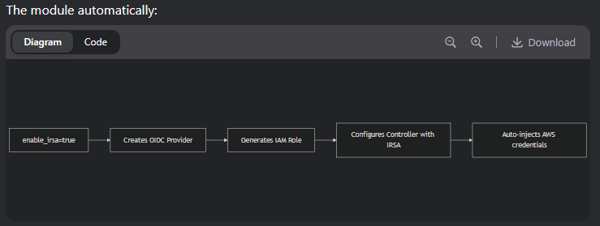

code source
https://spacelift.io/blog/terraform-eks

# branch: alb
extra: iam.tf for load_balancer_controller role and policies
# backend s3
https://github.com/KeenGWatanabe/tf-backend

What this module does

# INPUTS
vpc.tf ln3,4,6 name `bucket, folder, statefile`

# terraform eks
terraform init
terraform apply -target=module.eks
terraform apply

# verification steps
aws eks describe-cluster --name ${var.name_prefix}-eks-cluster
kubectl get nodes
kubectl get pods -n kube-system -l app.kubernetes.io/name=aws-load-balancer-controller

---------------------------------------------------------------------------------------

# connect with kubectl
aws eks --region us-east-1 update-kubeconfig --name rger-eks-cluster

# check log in to cluster
kubectl config current-context

# view running nodes
kubectl get nodes

# node details
kubectl get nodes -o custom-columns=Name:.metadata.name,nCPU:.status.capacity.cpu,Memory:.status.capacity.memory

-------------optional------------
# deploy nginx instance
kubectl run --port 80 --image nginx nginx

# view running pods
kubectl get pods

# setup a tunnel to this pod
kubectl port-forward nginx 3000:80
-------------optional------------

NOTE:
OIDC Provider in EKS
Automatically Created: Every EKS cluster gets an OIDC issuer URL (e.g., oidc.eks.REGION.amazonaws.com/id/XXXXX).

But: The OIDC provider must be registered in IAM before you can use it for IRSA.

# Verify IRSA is Working
# Deploy the ServiceAccount
kubectl apply -f service-account.yaml

# Run a test Pod with the ServiceAccount
kubectl run --rm -it test-pod --image=amazon/aws-cli --serviceaccount=app-service-account

# Inside the Pod, verify credentials
aws sts get-caller-identity

# eks-oidc runDate 20250615
Outputs:

cluster_endpoint = "https://25C0EFC0B536D775368708A3E0E9952A.gr7.us-east-1.eks.amazonaws.com"
cluster_name = "taskmgr-eks-cluster"
oidc_provider = "oidc.eks.us-east-1.amazonaws.com/id/25C0EFC0B536D775368708A3E0E9952A"   
oidc_provider_arn = "arn:aws:iam::255945442255:oidc-provider/oidc.eks.us-east-1.amazonaws.com/id/25C0EFC0B536D775368708A3E0E9952A"
vpc_id = "vpc-01a79ae8c8349b3c9"
